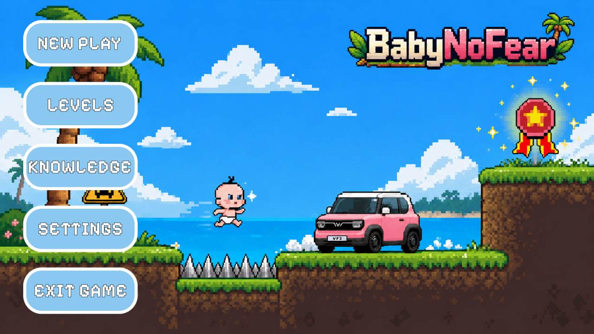
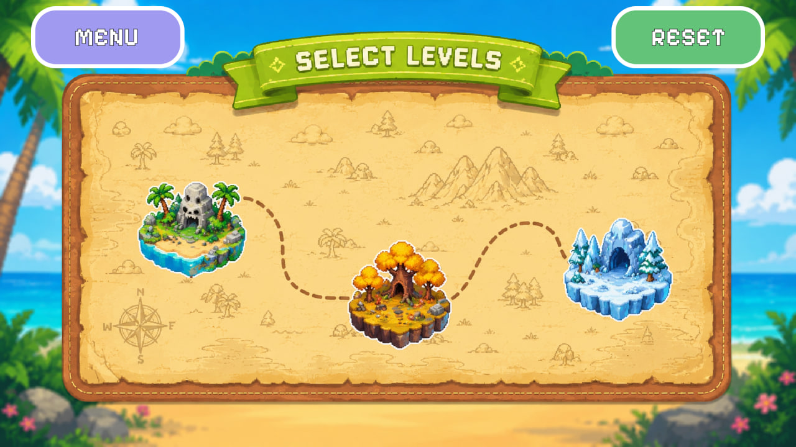
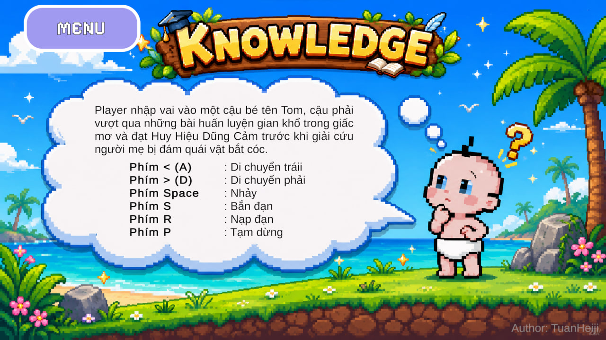
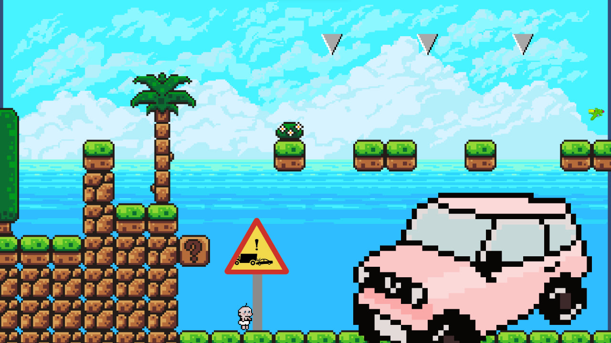
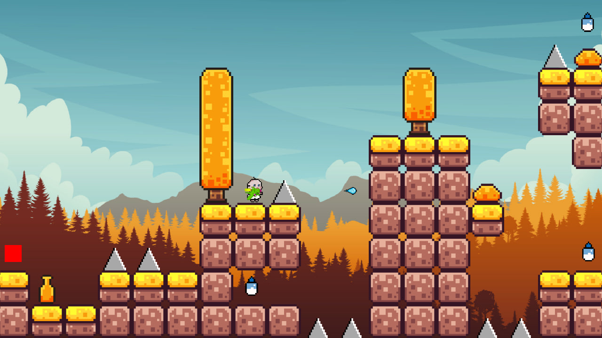
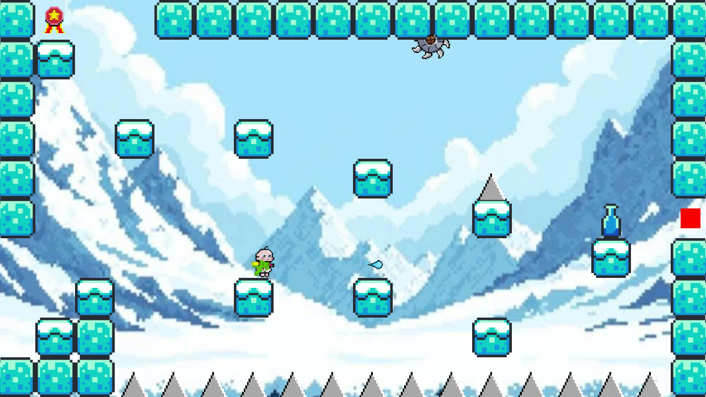
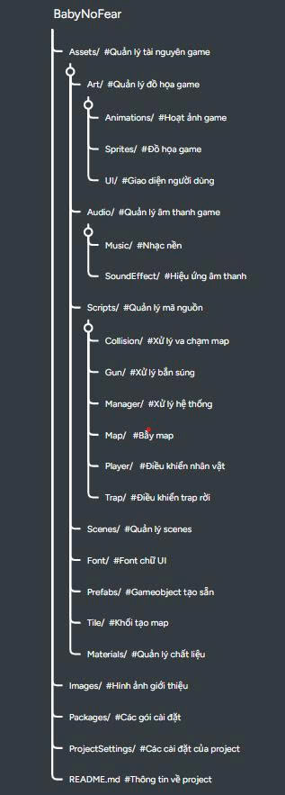

# Tên Dự Án
Tên dự án: "Game 2D pixel BabyNoFear"
Thể loại: RPG Puzzle

## UI

  

  

  

## Level 1

  

## Level 2

  

## Level 3

  

## Công Nghệ Sử Dụng
- C#
- Unity hub 
- Unity 6
- Visual studio 2022

## Cấu Trúc Dự Án

  

## Cách Chạy Dự Án

1. Clone project frontend:
- git clone https://github.com/TuanHeiji/BabyNoFear.git

2. Cài Unity hub và chọn editor version: 6000.0.55f1

3. Import vào unity

## Tác Giả
Tuấn Heiji